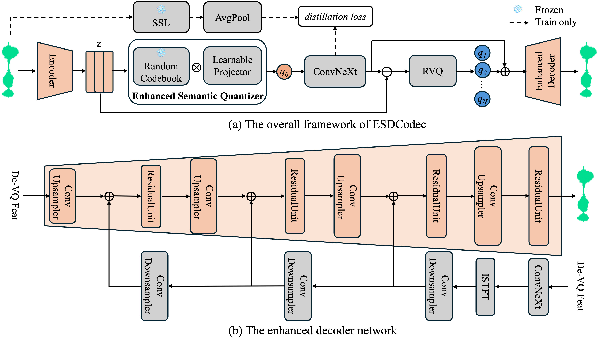

# ESDCodec: High-Fidelity Neural Speech Codec via Thoroughly Enhanced Semantic Quantizer and Decoder 

## Abstract
Despite recent advances in neural speech codecs, achieving high-fidelity speech reconstruction at low bitrates remains a formidable challenge. To address this limitation, we propose ESDCodec, a speech codec that integrates a thoroughly enhanced semantic quantizer and a conditioned decoder network. Specifically, we employ a randomly initialized and frozen codebook, followed by a lightweight projector, to encode semantic details entirely within a linear space while enhancing codebook utilization. To further improve perceptual quality, we design a condition network that injects prior subband knowledge into the upsampling decoder. Taking the de-quantized feature as input, this network predicts subband signals, thereby providing fine-grained guidance for waveform reconstruction. Extensive experiments show that ESDCodec achieves superior reconstruction performance at a low bitrate of 0.85kbps. For LLM-based speech generation task, ESDCodec also consistently outperforms existing codec models.

<!-- show esdcodec.png -->



## Installation
```bash
pip install esdcodec
```

## News
- 2026-02-24: Release ESDCodec training and inference codes.

## Model List
| Model| Frame Rate| Training Dataset |Discription|
|:----|:----:|:----:|:----|
|[esdcodec_25hz_16384_1024](https://huggingface.co/vspeech/ESDCodec/tree/main)|25Hz|Emilia(English and Chinese)|Adopt enhanced semantic quantizer and conditioned decoder network|

## Inference
1. First, download checkpoint and config to local: 
```
huggingface-cli download facebook/w2v-bert-2.0 --local-dir w2v-bert-2.0
huggingface-cli download vspeech/ESDCodec esdcodec_25hz_16384_1024.safetensors w2vbert2_mean_var_stats_emilia.pt --local-dir esdcodec_ckpts
```

2. To run example inference:
```bash
python infer.py
```

## Training
1. Clone and install
```bash
pip install "esdcodec[tts]"
git clone https://anonymous.4open.science/r/ESDCodec.git
cd ESDCodec
```

2. Prepare the training_file in config, e.g., Emilia dataset list data.list
```bash
/path/to/your/xxx.tar
/path/to/your/yyy.tar
...
```

3. To run example training on Emilia dataset
```bash
accelerate launch train.py --config-name=esdcodec_train \
trainer.batch_size=3 \
data.segment_speech.segment_length=96000
```

## Acknowledgement
This repo is directly based on the following excellent projects:

- [**DualCodec**](https://github.com/jiaqili3/DualCodec)
- [**DAC**](https://github.com/descriptinc/descript-audio-codec)
